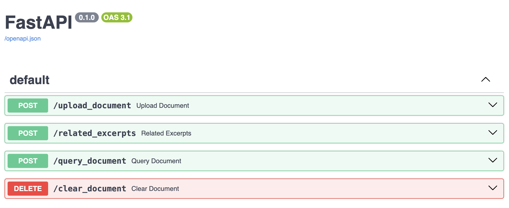
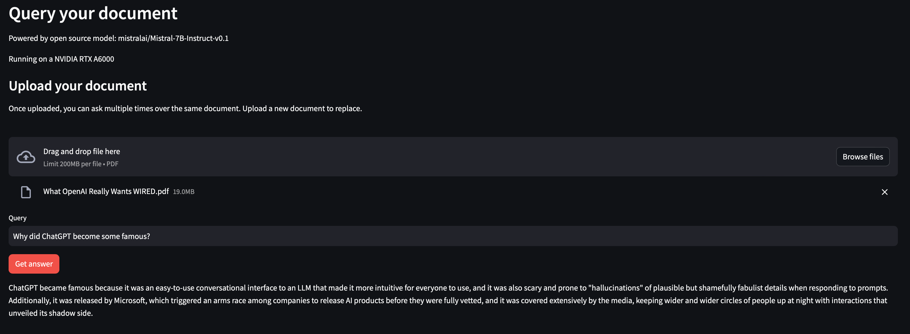

# LLM Document Query

## Description

This is a sample project to connect an open source LLM to a vector DB for question anwering over a PDF document.

This is known as RAG: [Retrieval Augmented Generation](https://research.ibm.com/blog/retrieval-augmented-generation-RAG). It provides additional information in the LLM context window together with the question, to provide an answer grounded on specific information. This reduces the probability of "hallucinations" and poor answers in general.

The way to fetch the relevant pieces of text is through semantic search based on embeddings. The vector DB stores embeddings for chunks of text of the reference document. This makes it possible to retrieve relevant texts based on semantic similarity, even if the words used do not appear in the text.

## Models and GPUs

We can use this demo with different open source models, namely:
* [Mistral-7B-Instruct-v0.1](https://huggingface.co/mistralai/Mistral-7B-Instruct-v0.1)
* [Llama-2-7b-chat-hf](https://huggingface.co/meta-llama/Llama-2-7b-chat-hf)
* [Falcon-7b-instruct](https://huggingface.co/tiiuae/falcon-7b-instruct)
* [MPT-7b-chat](https://huggingface.co/mosaicml/mpt-7b-chat)

Check the links to see the respective model cards.

These are all "entry-level" LLMs that fit in a single GPU and are therefore particularly suitable for a proof-of-concept. Their reasoning ability is limited but they are nevertheless very capable.

These models are chosen because they are from four distinct families. All of them come from a different, independent foundation model, as opposed to variations over the same Llama foundation model, for example. They are not comparable in terms of performance (check the leaderboard [here](https://huggingface.co/spaces/HuggingFaceH4/open_llm_leaderboard) for details), but the idea here is to showcase how we can seamlessly use very different models, all with GPU acceleration.

This prototype was tested on a NVIDIA RTX A6000 on Ubuntu Server 22.04, but it should work on any Linux system with CUDA drivers for other NVIDIA GPU models.

## Dependencies

The prototype is developed in python and needs the dependencies listed under `requirements.txt`. They can be installed as usual in any python development environment with:
```
pip install -r requirements.txt
```
(A virtual environment is recommended)

Note that the list includes dependencies which are helpful for development but not strictly necessary for a deployment setting, e.g. `mypy`.

This prototype requires python>3.9. It was tested with python 3.10.12. Other versions might need to recreate dependencies to avoid conflicts.

## Configuration

A `.env` file must be created and placed at the root of the repo with the following environment variables:
* `LLM_TYPE`: A string indicating the model to use. It can be "MISTRAL", "LLAMA2", "FALCON", or "MPT". The value "FAKE" is used for development purposes only. Once changed, the service needs to be restarted to take effect.
* `HUGGINGFACE_TOKEN`. This is the token from a HuggingFace account, which has access granted to the Llama2 family of models. Access can be requested directly from [the model card](https://huggingface.co/meta-llama/Llama-2-7b-chat-hf). A token can be generated, as described [here](https://huggingface.co/docs/hub/security-tokens). A read-only token is recommended. This is only needed for the LLAMA2 model. Other models can work without this token. A single token can be reused across instances. Please, treat this token as a secret to avoid abuse.

## Interface

There are 2 ways to use this prototype:
* Via API with FastAPI
* Via web UI with Streamlit

### API with FastAPI

We can spin up a FastAPI server from the repo root folder, provided all dependencies are installed, as follows:
```
cd <app_dir>
source <virtualenv_dir>/bin/activate
export PYTHONPATH=$PYTHONPATH:`pwd`
python app/main.py
```

This will start a FastAPI server listening at port 5000. You can check the endpoints at `http://localhost:5000/docs`.



* `upload_document`: Used to upload a PDF file over which to answer the questions. The document is chunked and stored in the vector DB for semantic search.
*  `related_excertps`: Returns a list of the 3 most relevant chunks for a given query.
*  `query_document`: Returns an anwers for a given query, using chunks from the uploaded document for context.
*  `clear_document`: Clear a previously uploaded document from the vector DB.

### GUI client with Streamlit

We can start a GUI client, accessible via browser, to use the prototype interactively, as follows:
```
cd <app_dir>
source <virtualenv_dir>/bin/activate
export PYTHONPATH=$PYTHONPATH:`pwd`
streamlit run app/frontend/gui.py
```

This will start the service at `http://localhost:8501/`.



## Configurable parameters

The main configurable parameter is the model type, which is specified in the environment variable `LLM_TYPE`, as described above. Any change to this variable requires that the service is restarted.

There are other configurable parameters, which are currently hardcoded in the `/app/resources/database.py` file. These can be used to modify some details related to the DB configuration and are described here for completion. Use at your own risk. Any change requires a service restart.
* `SPLIT_CHUNK_SIZE`. Size in characters of each chunk stored in the DB. A larger chunk is more cohesive and may contain more information but it may be harder to capture with a single embedding.
* `SPLIT_CHUNK_OVERLAP`. Amount of characters to overlap in contiguous chunks.
* `SENTENCE_TRANSFORMERS_MODEL`. Model to calculate the embeddings for the vector DB.
* `DB_FOLDER`. Folder where the vector DB is stored. By default, it is found under `/app/db`.
* `FILES_FOLDER`. Folder where the uploaded file is stored. By default, it is found under `/app/files`. Everytime a new file is uploaded, any existing files are deleted.
* `COLLECTION_NAME`. Name for the collection of chunks in the vector DB.
* `TOP_K_MATCHES`. Number of matches to retrieve from the vector DB to provide context for the LLM. A larger number may provide more context, but may also run more easily into limits of the context window or add irrelevant data, which may confuse the model.
* `MMR_FETCH_K`. Experimental value. Not currently used.

## Limitations

Please, be aware of the following limitations:
* The prototype is single-user only and it keeps the state of the last uploaded document. This means the user can ask multiple questions over the same document by uploading it only once, but new uploads will invalidate the previous document.
* There is no authentication. If you expose the service in a public IP, anyone with knowledge of the IP will have access to the service.
* Questions that are found in the document will generally be answered quite well, but questions for content not found in the document will not be so relevant. For instance, if you upload a document about taxes but ask about health advise, you won't get good results.
* Text summarization will not work in general, since the LLM will only consider a small part of the document at a time, and not the whole document.
* PDFs with images will generally not work well, since the models used are not multi-modal and only text is extracted from the PDFs.
* Other document formats are not currently supported.